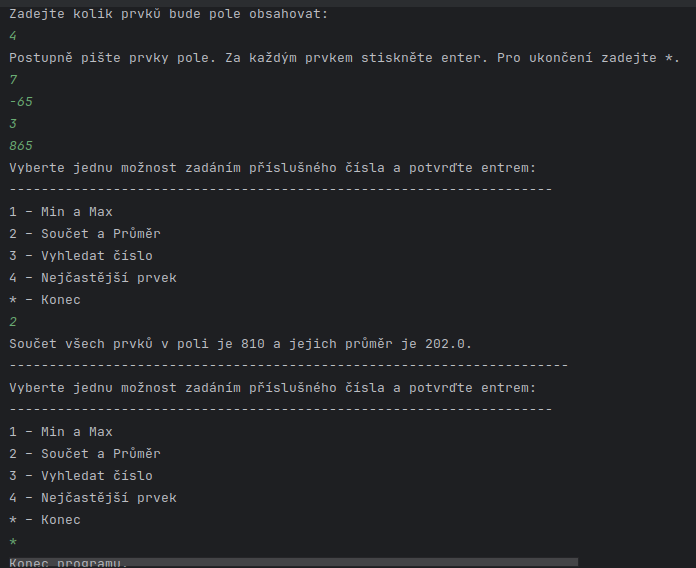

# Array Analyzer

Konzolová aplikace pro analýzu uživatelem zadaných čísel podle několika předem definovaných operací.  
Projekt je součástí mého programátorského portfolia.

---

## Funkce

Program umožňuje provádět následující analýzy:

- 1 – Minimum a maximum
- 2 – Součet a průměr
- 3 – Vyhledání konkrétního čísla
- 4 – Nejčastější prvek (modus)

---

## Ovládání

1. Zadejte počet čísel (velikost pole)
2. Zadejte jednotlivé hodnoty
3. Vyberte operaci z menu
4. Analýzu lze opakovat
5. Program lze kdykoliv ukončit pomocí znaku `*`

---

## Ukázka běhu
Tato aplikace umožňuje analyzovat číselná data zadaná uživatelem a poskytuje základní statistické operace.
```
Zadejte kolik prvků bude pole obsahovat:
5
Postupně pište prvky pole. Za každým prvkem stiskněte enter. Pro ukončení zadejte *.
3
6
88
3
1
Vyberte jednu možnost zadáním příslušného čísla a potvrďte entrem:
--------------------------------------------------------------------
1 – Min a Max
2 – Součet a Průměr
3 – Vyhledat číslo
4 – Nejčastější prvek
* – Konec
4
Nejčastěji vyskytující se prvek je:3
```
---

## Ukázka výstupu (screenshot)



---

## Spuštění

1. Naklonujte (clone) nebo forkujte tento repozitář
2. Otevřete projekt ve svém IDE (např. IntelliJ IDEA)
3. Spusťte hlavní třídu aplikace

Program běží jako konzolová aplikace.

---

## Použité technologie

- Java
- Práce s poli (arrays)
- Řízení toku programu (control flow)
- Ošetření výjimek (exception handling)

---

## Co jsem se naučil

- Práce s polem a jeho zpracování
- Návrh struktury programu (rozdělení do tříd)
- Základy algoritmizace
- Použití obalových tříd (wrapper classes)

---

## Poznámky k implementaci

Algoritmus pro výpočet modu (nejčastějšího prvku) má časovou složitost:

O(n²)

Pro účely tohoto projektu je tato složitost dostačující, protože se nepředpokládá práce s extrémně velkými vstupy.

---

## Autor

Vladimír Denkr
